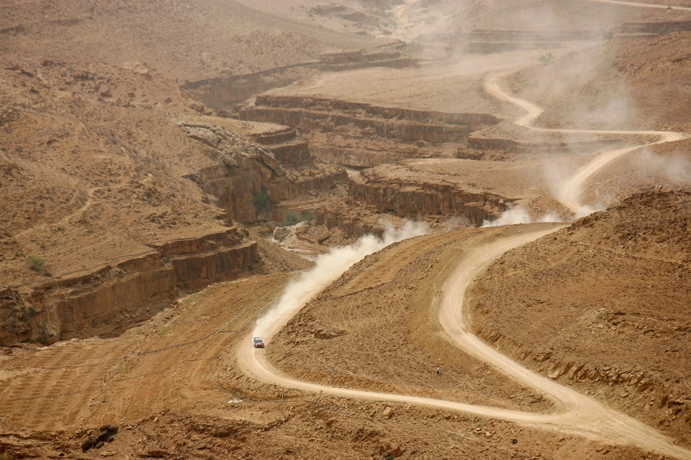
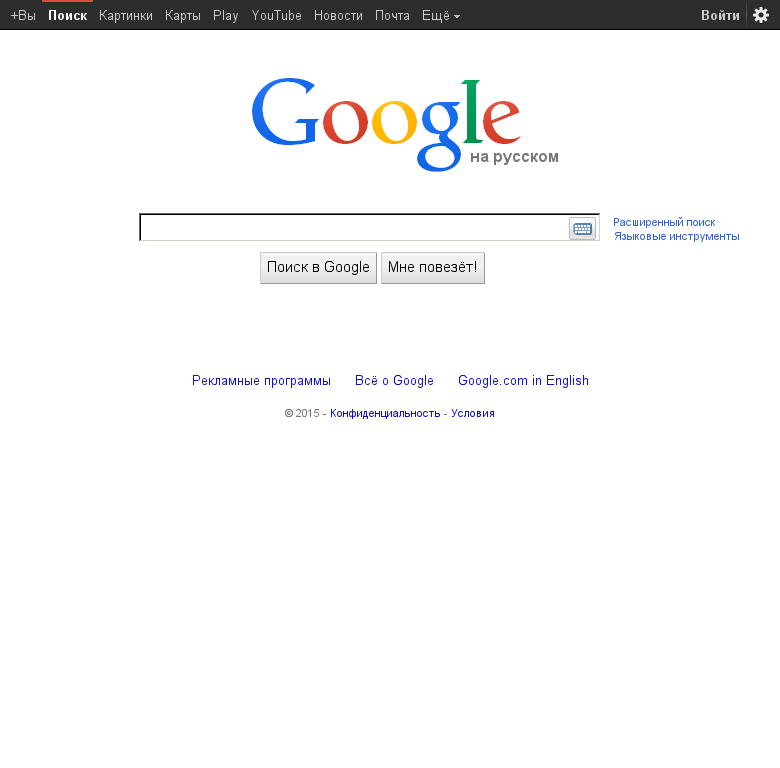
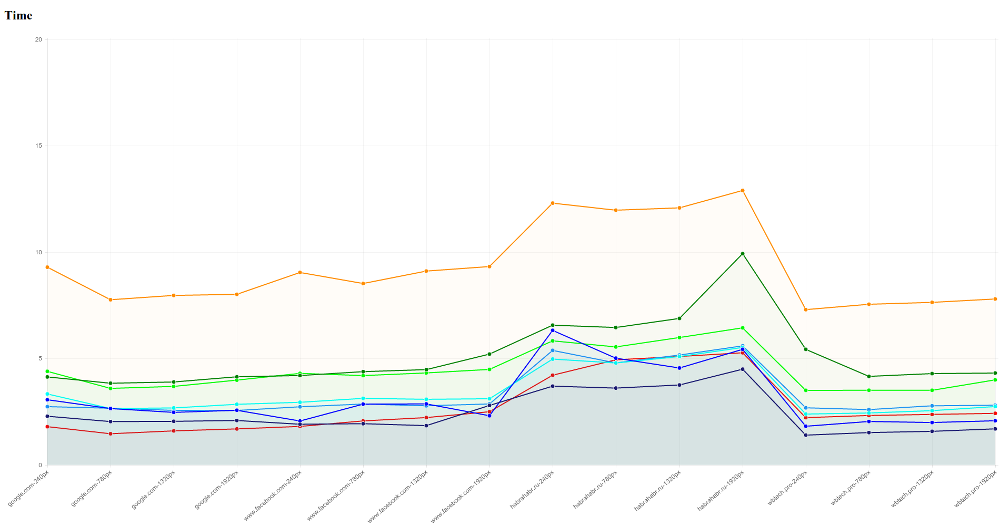
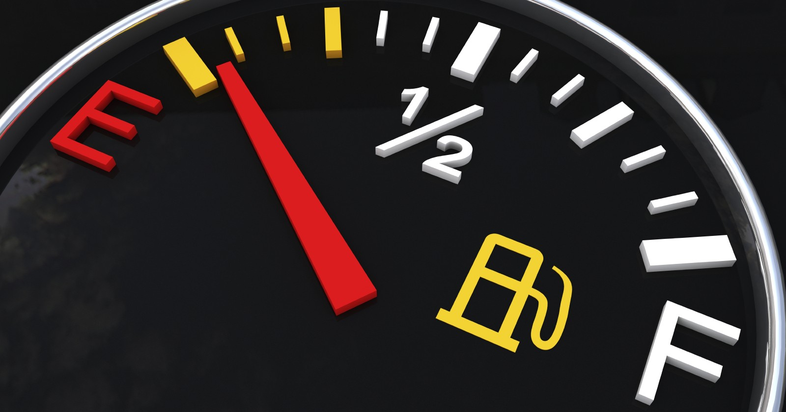
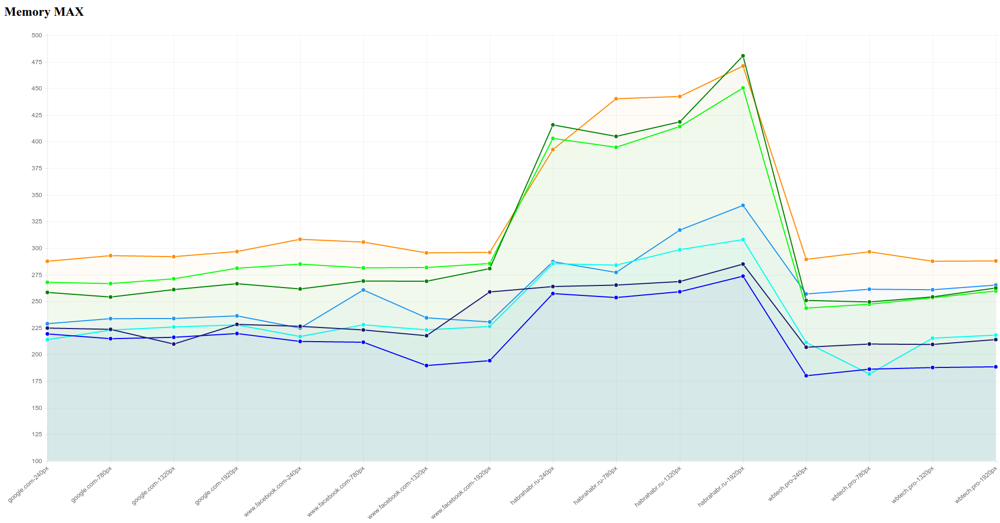
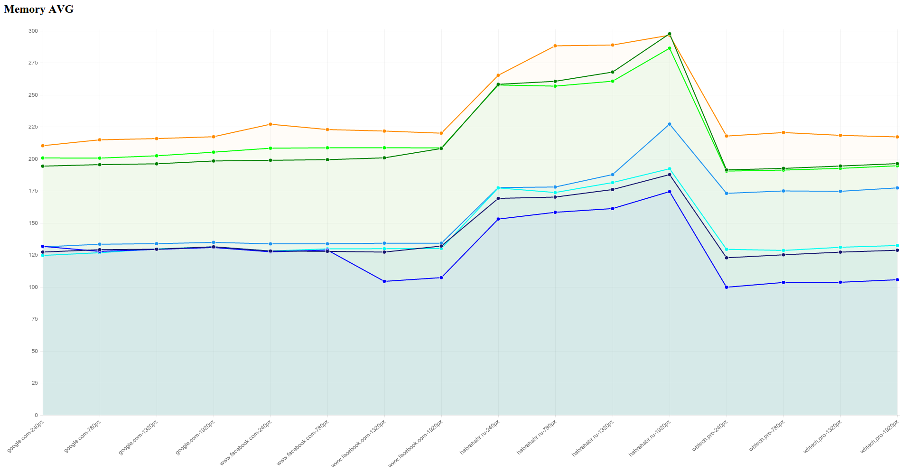
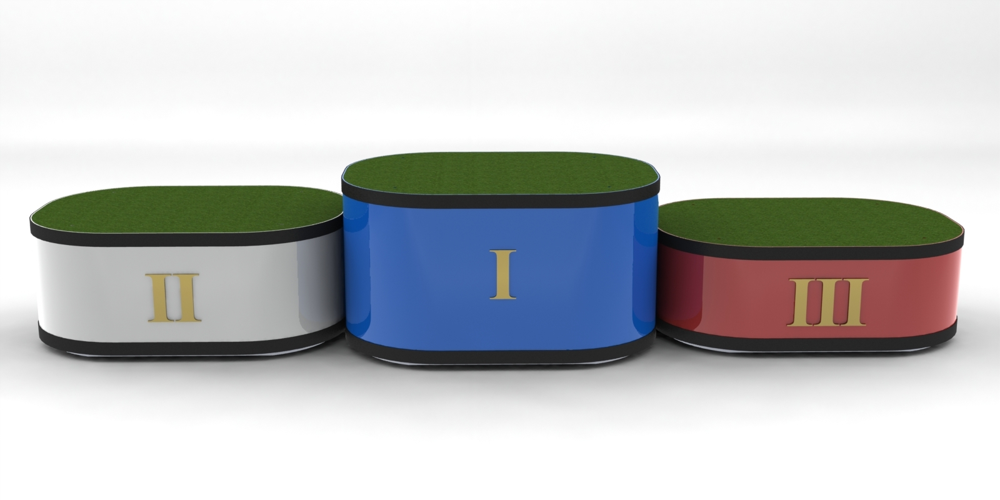

#Ралли на браузерах

Собственный проект [WB&mdash;Tech](http://wbtech.pro/) по комментированию
скриншотов [coment.me](http://coment.me/) на сегодняшний день, для получения
снимка сайта, использует связку `selenium + firefox`. Данный подход решает
задачи получения скриншота, однако тратит достаточно много памяти, и к тому же
со временем накапливается большое количество повисших процессов, что в свою
очередь приводит к подвисанию сервиса. В связи с этим, необходимо исследовать
доступные варианты и определить наилучший из браузеров для автоматического
создания скриншотов.


##Участники соревнований
На участие в ралли были отобранны следующие кандидаты:

- Firefox `36.0.1`
- Google Chrome `41.0.2272.89`
- Chromium `Not tested`
- [Splash](http://splash.readthedocs.org/en/latest/) `1.5`
- [Ghost.py](http://ghost-py.readthedocs.org/en/latest/) `0.1.1`
- [Zombie.js](https://github.com/ryanpetrello/python-zombie/) `0.2.0`
- [Pantom.js](http://phantomjs.org/) `1.9.8`, `2.0.0`
- [Awesomium](http://awesomium.com/) `Not tested`
- [Slimer.js](http://slimerjs.org/) `0.9.5`, `0.10.0pre`

Итак, участники отобраны, и готовы показать себя во всей красе, чтож &mdash;
приступим к соревнованиям.


##Трасса


Для наших, замечательных конкурсантов, предстоит пройти трек по пересеченной
местности c четырьмя крутыми поворотами с 16-ю чекпоинтами, а именно &mdash;
показать свои навыки на следующих ресурсах:

- https://google.com/
- https://www.facebook.com/
- http://habrahabr.ru/
- http://wbtech.pro/

при следующих разрешениях экранов по ширине: `240`, `780`, `1320`, `1920`
пикселей.


####Технические неполадки
На данный момент не удалось корректно запустить `Awesomium`, так что он снят с
соревнований по техническим причинам. Не победитель, не побежденный.


##Заезд первый &mdash; &laquo;Качество&raquo;
>Качество &mdash; это делать что-либо правильно, даже когда никто не смотрит.

Поскольку, в конечном счете, результат должен быть не хуже, чем имеющийся на
настоящий момент &mdash; эталоном качества будут выступать снимки огненной
лисы.

На данном этапе сошли с дистанции сразу 4 участника. Причем, если бы я делал
ставки &mdash; то проиграл бы, ведь хром, которого я считал фаворитом
соревнований, оказался некомпетентным.


####Только видимая область
Для связки `selenium`а и `google chrome`
необходимо использовать `chromedriver` текущая стабильная версия `2.14`.
И, как оказалось, мало того &mdash; что скачать его можно только через VPN,
так ещё и в нем содержится баг, который тянется с 2013 года, известным issue.
Хром драйвер &mdash; не пролистывает окно браузера при захвате изображения,
а делает снимок видимой области.
>

Так что `Google Chrome` и `Chromium` не прошли данный этап.


####Неверный resize
Безголовый браузер `Splash`, запускается демоном и слушает `localhost:8050`, по
которому предоставляет `http api` управления браузером. Для сохранения скриншота
необходимо указать адрес сайта и ширину окна браузера.
```python
request = 'http://localhost:8050/render.png?\
url={url}&width={res}&render_all=1&wait=1'.format(url=url, res=res)
res = subprocess.check_call(['curl', request, '-o', save_as])
```
Однако, как оказалось, ширина окна браузера &mdash; всегда 1024px, а параметр
`width` &mdash; влияет только на фактическую ширину полученного изображения,
к тому же сжатого как thumbnail.

>240px<br />
><hr />
>780px<br />

Так что splash не прошел данный этап.


####&laquo;Что я вообще сдесь делаю&raquo; &copy; Zombie


Как оказалось зомби вообще не умеет делать скриншоты, поэтому выбывает из
соревнований.


####Фальшивые паспорта &mdash; старый гугл
Некоторые из участников соревнований, а именно Фантом и Лизун, не смогли бы
пройти все этапы ралли, под своими именами, поэтому пришлось выдать им фальшивые
паспорта.

Google выдает различные версии сайта, в зависимости от того какой user agent у
браузера запрашивающего страницу, и если этот агент неизвестный или старый, то
выдается старая версия гугл, с черной полоской меню.
>Phantom.js 240px
><hr />
>Slimer.js 240px<br />


Но при использовании поддельных паспортов, от файрфокса результат такой как
нужно.
```python
'Mozilla/5.0 (X11; Linux x86_64) Gecko/20100101 Firefox/36.0'
```
>


####Пикселизация &mdash; выколи глаза.
Ghost.py не очень хорошо умеет захватывать картинки, логотип google выглядит
похожим на забор.
>

Хоть это и недопустимо, однако ограничимся предупреждением, и пропустим призрака
в следующий тур.


###Результаты первого заезда
Во второй тур прошли 4 участника и 4 участника покинули соревнования.
Турнирная таблица по окончанию первого этапа.
- :white_check_mark: Firefox
- :white_check_mark: Pantom.js
- :white_check_mark: Slimer.js
- :warning: Ghost.py
- :x: Chromium
- :x: Google Chrome
- :x: Splash
- :x: Zombie.js
- :heavy_multiplication_x: Awesomium


##Заезд второй &mdash; &laquo;Скорость&raquo;


На данном этапе измерялось время, необходимое для создания браузера,
открытия нужной страницы, изменения ширины окна до заданной, сохранения страницы
как изображения PNG, закрытия страницы и уничтожения объекта браузера.

Измерения проводились при помощи стандартной библиотеки `time`, как разница
времени между до запуска функции, и после её окончания. 

```python
import time
# ...
    start = time.time()
    # call test browser fun()
    end = time.time()
# ...
    times.append(end - start)
```




###Результаты второго заезда
В ходе данного этапа, участники заняли следующие места:

1. Phantom.js `2.x`
1. Phantom.js `1.x`
1. Ghost.py
1. Phantom.js `1.x` + selenium
1. Phantom.js `2.x` + selenium
1. Slimer.js `9.x`
1. Slimer.js `10.x`
1. Firefox + selenium

В результате, ни один из участников не оказался хуже огненной лисы, поэтому
выбывших нет, все переходят к следующему этапу.


##Заезд третий &mdash; &laquo;Ресурсы&raquo;



Учитывалась память которую тратит главный процесс, и все его дочерние процессы.
Память измерялась при помощи функции `memory_usage` библиотеки `memory_profiler`
с указанием параметра `include_children`.

Измерялась минимальная, средняя, и максимальная память для каждого скриншота.

```python
from memory_profiler import memory_usage
# ...
    memory = memory_usage((fun, args), include_children=True)
# ...
    mins.append(min(memory))
    maxs.append(max(memory))
    avgs.append(avg(memory))
```


####Ненасытное привидение
Ghost.py &mdash; оказался чрезвычайно прожорливым, занимая всю доступную память
доходил до максимума и вылетал. Единственный из участников, кто не сумел пройти
все 16 чекпоинтов за один подход.

Учитывая, вынесенное ранее предупреждение &mdash; призрак вылетает из конкурса!
>I ain't afraid a no ghosts


####Двуличный хитрец
Оказалось что Лизун притворяется, запускается дочерний процесс `slimerjs`,
который потребляет не более 3 Mb памяти, но при этом запускает ещё один
дочерний процесс с именем `firefox`, который уже добирает память до 300 Mb.


####Общие затраты памяти
Поскольку Ghost потребляет уж слишком много ресурсов, на графиках не
указывается.






###Результаты третьего заезда
В ходе данного этапа, участники заняли следующие места:

1. Phantom.js `1.x`
1. Phantom.js `2.x`
1. Phantom.js `1.x` + selenium
1. Phantom.js `2.x` + selenium
1. Slimer.js `9.x`
1. Slimer.js `10.x`
1. Firefox + selenium
1. Ghost.py

На этом этапе выбывает `Ghost.py`, турнирная таблица принимает вид:
- :white_check_mark: Pantom.js
- :white_check_mark: Slimer.js
- :white_check_mark: Firefox
- :x: Ghost.py


##Заезд четвертый &mdash; &laquo;Управляемость&raquo;


Несмотря на то, что определилась тройка лидеров и уже можно подвести итоги,
рассмотрим как управлять безголовыми браузерами.


####Огненная лиса
Firefox работает в связке с `selenium`-ом и управляется достаточно просто,
единственная особенность &mdash; это то, что браузер запускает графическую
оболочку поэтому нужно использовать виртуальный дисплей.

```python
from selenium import webdriver
from pyvirtualdisplay import Display
# ...
with Display(**display_params):
    browser = Browser(**param)
    browser.set_window_size(width, 768)
    browser.get(url)
    browser.save_screenshot(save_as)
    browser.quit()
```

####Фантом
Phantom.js можно использовать как самостоятельный безголовый браузер, так и в
связке с `selenium`-ом.
Работа с селениумом аналогична огненной лисе, за тем лишь исключением, что нет
необходимости запускать виртуальный дисплей.

Собственная работа фантома, заключается в вызове консольной команды, и передаче
ей скрипта для выполнения браузером.

```javascript
var page = require('webpage').create();
page.settings.userAgent = 'Mozilla/5.0 (X11; Linux x86_64) Firefox/36.0';
page.viewportSize = { width:1920, height:768 };
page.open('http://wbtech.pro/', function (status) {
    page.render('img/phantomjs2-no_selenium/wbtech.pro-1920px.png');
    phantom.exit();
});
```
В python запускаем браузер с помощью стандартной библиотеки `subprocess`.

```python
import subprocess
# ...
subprocess.check_call([phantom_path, script_path, '--ssl-protocol=any'])
```


####Лизун
Slimer.js работает точно так же, как и фантом без селениума, но является не
совсем безголовым, он запускает графическую оболочку, поэтому требует
виртуальный дисплей.

А так же, в ходе тестирования было выявлено, что для корректного скриншота
нужно всегда, перед открытием страницы - указывать базовую ширину окна
браузера.

```javascript
var page = require('webpage').create();
page.viewportSize = { width:1024, height:768 };
page.settings.userAgent = 'Mozilla/5.0 (X11; Linux x86_64) Firefox/36.0';
page.open('http://wbtech.pro/', function (status) {
    page.viewportSize = { width:1920, height:768 };
    page.render('img/slimerjs10/wbtech.pro-1920px.png');
    page.close();
    slimer.exit();
});
```
В python запускаем браузер с помощью стандартной библиотеки `subprocess`.

```python
from pyvirtualdisplay import Display
import subprocess
# ...
with Display(**display_params):
    subprocess.check_call([slimer_path, script_path, '--ssl-protocol=any'])
```


##Финиш


Гонка завершилась, пришло время подвести итоги и определить победителей.

До финиша доехали всего три команды, так что тройка лидеров очевидна. Учитывая
затраты ресурсов и времени участники занимают следующие места:

1. Phantom.js `2.x`
1. Phantom.js `1.x`
1. Phantom.js `1.x` + selenium
1. Phantom.js `2.x` + selenium
1. Slimer.js `9.x`
1. Slimer.js `10.x`
1. Firefox + selenium

Безоговорочным лидером гонки стал фантом, в качестве награды, ему будет
предложено занять пост огненной лисы, на сервисе [coment.me](http://coment.me/).


